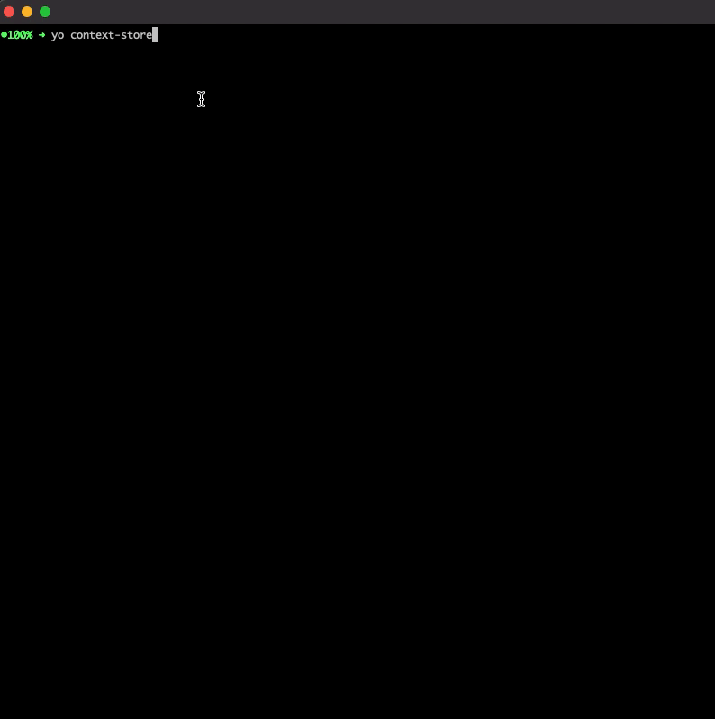

## quickly scaffold out a redux like directory store using the react context api




```bash
npm install -g yo
npm i -g generator-context-store
```

```bash
yo generator-context-store
```
output is directory relative to where cli command is ran
EX with prefix of 'foo'
```bash
fooStore
    ├── FooStoreProvider.tsx
    ├── actions.ts
    ├── devtools.ts
    ├── index.ts
    ├── initialState.ts
    ├── reducer.ts
    └── store.ts
```
